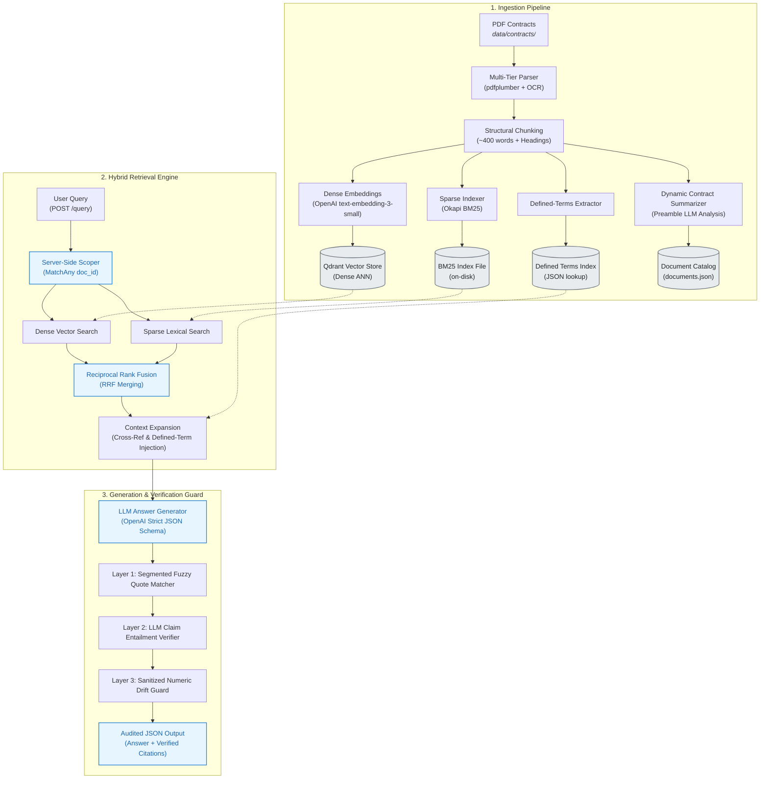

# Legal Contract RAG

A robust, containerized Legal Contract RAG (Retrieval-Augmented Generation) prototype designed to accurately extract and cite information from complex legal documents while aggressively guarding against LLM hallucinations.

---

## Architecture Overview



---

## Core Capabilities

| Capability | Technical Mechanism | Benefit |
| :--- | :--- | :--- |
| **Convention-Agnostic Parsing** | Multi-tier detection (Layout $\rightarrow$ Regex capture groups $\rightarrow$ Semantic drop) | Parses Roman articles (`Article XV`), decimal sections, and subclauses across any contract. |
| **Dynamic Document Summarization** | Ingest-time preamble analysis (parties, recitals, commercial scope) | Dynamically synthesizes 1-sentence contract summaries cached in metadata with zero query latency. |
| **Server-Side Hybrid Retrieval** | Dense vector search (Qdrant) + Sparse lexical (BM25) fused via RRF | Captures semantic intent without losing exact legal jargon, party names, or section numbers. |
| **Cross-Reference Resolution** | Automated scanning for defined terms and `Section X.Y` pointers | Eliminates semantic gaps by auto-injecting referenced definitions into the context window. |
| **Triple-Layer Guardrails** | Segmented fuzzy quote check + LLM claim entailment + numeric drift filter | Guarantees zero hallucinations; validates quotes with `...` and rejects invented figures. |
| **Compound Query Handling** | Multi-intent prompt routing with partial-grounding priority rules | Answers supported questions with citations and declares absence for unmentioned topics. |

---

## Project Structure

```
.
├── app/
│   ├── main.py           # REST API endpoints (/ingest, /query, /evaluate, /health)
│   ├── ingest.py         # PDF parsing, chunking, and dual-index building
│   ├── chunking.py       # Multi-tier layout and regex heading detection, sub-chunking
│   ├── defined_terms.py  # Defined terms index builder and lookup scanner
│   ├── retrieval.py      # Server-side hybrid retrieval (Qdrant + BM25 + RRF)
│   ├── generation.py     # Strict structured generation and system prompts
│   ├── verification.py   # Triple-layer citation grounding, entailment, and numeric guards
│   └── evaluate.py       # Evaluation dataset loader and pipeline runner
├── data/                 # Persistent storage volume
│   ├── contracts/        # Target directory: place PDF contracts here
│   └── eval_set/         # Benchmark evaluation dataset
├── docker-compose.yml    # Container orchestration (FastAPI + Qdrant)
├── Dockerfile            # Application container specification
├── requirements.txt      # Python dependencies
└── README.md             # Project documentation
```

---

## PDF Storage Instructions

> All target PDF contracts must be placed inside the **`data/contracts/`** directory.

* **Supported Input:** Standard text-based `.pdf` / `.PDF` documents.
* **OCR Fallback:** Automatic `pytesseract` image extraction on scanned/image-only pages.
* **Data Persistence:** The `./data` host directory is mounted as a persistent Docker volume (`./data:/app/data`).

---

## Quickstart Guide

### 1. Environment Setup
Copy the environment template and provide your API credentials:
```bash
cp .env.example .env
```
Ensure `.env` contains your Vercel AI Gateway key:
```env
AI_GATEWAY_KEY=your_key_here
AI_GATEWAY_BASE_URL=https://ai-gateway.vercel.sh/v1
```

### 2. Launch Services
Start the application and Qdrant vector database:
```bash
docker compose up --build
```
* **API Endpoint:** `http://localhost:8000`
* **Swagger Documentation:** `http://localhost:8000/docs`

---

## API Reference

### 1. List Ingested Documents (`GET /documents`)
Returns a list of all indexed canonical document IDs along with **dynamically generated one-sentence contract summaries** (synthesized by the LLM from each contract's preamble during ingestion and cached with zero query latency). Users can reference these to easily identify agreements and supply valid `doc_filter` substrings for scoped queries.
```bash
curl http://localhost:8000/documents
```
**Sample Response:**
```json
{
  "documents": [
    {
      "doc_id": "ACCELERATEDTECHNOLOGIESHOLDINGCORP_04_24_2003-EX-10.13-JOINT VENTURE AGREEMENT.PDF",
      "description": "The contracting parties are Collectible Concepts Group, Inc. and Pivotal Self Service Tech, Inc., and the core commercial purpose of the contract is to form a joint venture named MightyCell Batteries for marketing batteries and related products."
    },
    {
      "doc_id": "BellringBrandsInc_20190920_S-1_EX-10.12_11817081_EX-10.12_Manufacturing Agreement1",
      "description": "The manufacturing agreement is between Stremicks Heritage Foods, LLC and Premier Nutrition Corporation for the production of food products by Heritage for Premier."
    },
    {
      "doc_id": "Freecook_20180605_S-1_EX-10.3_11233807_EX-10.3_Hosting Agreement",
      "description": "The contracting parties are Natalija Tunevic, director of FreeCook, and Mitchell Vitalis, director of Mitchell's Web Advance, PLC, for the purpose of designing and developing a website for the Client."
    },
    {
      "doc_id": "MorganStanleyDirectLendingFund_20191119_10-12GA_EX-10.5_11898508_EX-10.5_Trademark License Agreement",
      "description": "The contract is between Licensor and Licensee, granting Licensee a non-exclusive license to use the Brand for Permitted Activity, with specific conditions regarding sublicensing and ownership rights."
    },
    {
      "doc_id": "PenntexMidstreamPartnersLp_20150416_S-1A_EX-10.4_9042833_EX-10.4_Transportation Agreement",
      "description": "The contract is between Transporter, which owns and operates a natural gas transportation system, and Customer, who has the right to deliver gas for transportation, under the terms of the Transportation Agreement."
    }
  ]
}
```

#### Determining `doc_filter` from the Document Catalog
The `doc_filter` parameter in `POST /query` supports case-insensitive substring matching. You can pick any distinctive keyword from the returned `doc_id` or description:

| Target Document | Matching `doc_filter` Examples |
| :--- | :--- |
| **Joint Venture Agreement** (`ACCELERATEDTECHNOLOGIES...`) | `"Joint Venture"`, `"Accelerated"`, `"MightyCell"` |
| **Manufacturing Agreement** (`BellringBrandsInc...`) | `"Bellring"`, `"Manufacturing"`, `"Heritage"` |
| **Hosting Agreement** (`Freecook...`) | `"Freecook"`, `"Hosting"`, `"Advance"` |
| **Trademark License** (`MorganStanleyDirectLendingFund...`) | `"Morgan Stanley"`, `"Trademark"`, `"License"` |
| **Transportation Agreement** (`PenntexMidstreamPartnersLp...`) | `"Penntex"`, `"Transportation"`, `"Midstream"` |

* **Broad vs. Narrow Filters:** If a filter matches multiple documents (e.g. `"Manufacturing"` matching several manufacturing agreements), the system dynamically resolves all matching IDs and scopes the search across all of them via server-side `MatchAny`. To target an exact document, include a unique qualifier such as the entity name or filing year (e.g., `"Bellring"` or `"2019"`).

---

### 2. Ingest Documents (`POST /ingest`)
Parses and builds the dense and sparse indices from `data/contracts/`.
```bash
curl -X POST http://localhost:8000/ingest
```

---

### 3. Query Contracts (`POST /query`)

#### Scoped Single-Document Query:
```bash
curl -X POST http://localhost:8000/query \
  -H "Content-Type: application/json" \
  -d '{
    "question": "What is the governing law of the Joint Venture Agreement?",
    "doc_filter": "JOINT VENTURE"
  }'
```

#### Multi-Document Cross-Comparison Query:
```bash
curl -X POST http://localhost:8000/query \
  -H "Content-Type: application/json" \
  -d '{
    "question": "What is the governing law specified across all agreements?"
  }'
```

#### Response Structure:
```json
{
  "answer": "The governing law of the Joint Venture Agreement is the laws of the Commonwealth of Pennsylvania, as stated in Section 14...",
  "citations": [
    {
      "doc_id": "ACCELERATEDTECHNOLOGIESHOLDINGCORP..._JOINT VENTURE AGREEMENT.PDF",
      "section_id": "14",
      "quote": "...construction and interpretation... shall be interpreted and construed under the laws of the Commonwealth of Pennsylvania...",
      "section_unconfirmed": false
    }
  ],
  "insufficient_context": false,
  "failed_citations": [],
  "is_unverified": false
}
```

---

### 4. Batch Faithfulness Evaluation (`POST /evaluate`)
Executes the gold-standard 20-question legal benchmark and reports `ragas` faithfulness:
```bash
curl -X POST http://localhost:8000/evaluate
```

---

## Bonus Tasks Mapping

| Assessment Item | Implementation Component | File Location |
| :--- | :--- | :--- |
| **Bonus 1: Hybrid Search** | Dense Qdrant + Okapi BM25 with Reciprocal Rank Fusion & Server-Side Filtering | `app/retrieval.py` |
| **Bonus 2: Anti-Hallucination** | Segmented quote grounding, LLM entailment verification & numeric drift guard | `app/verification.py` |
| **Bonus 3: Faithfulness Evaluation** | Benchmark execution with `ragas` faithfulness & guardrail containment metrics | `app/main.py` |
| **Bonus 4: Docker Compose** | Multi-container orchestration (FastAPI + Qdrant) with persistent volume mounts | `docker-compose.yml` |
